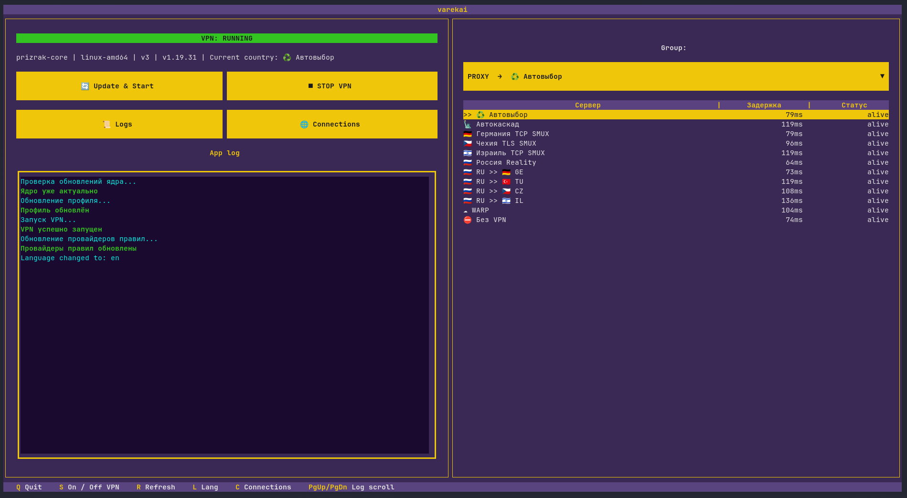

# Varekai Client

[English](README.md) | [Русский](README.ru.md)



A cross-platform TUI for the [Prizrak-Core kernel](https://github.com/legiz-ru/Prizrak-Core).
Maximum simplicity for everyone.

## Features

- Updates the core and your config on every run, with GitHub mirror fallback for blocked regions. You can add your own mirrors
- Injects "smart" proxy-group strategies into your config
- Runs the VPN only in TUN mode (requires admin/root)
- Keeps the last 3 core versions and can roll back
- The core runs independently: closing the launcher does not stop the VPN
- Russian and English languages
- Supports mouse control 

## Supported platforms

| OS | Architectures |
| --- | --- |
| Windows 10/11 | x86_64 |
| Linux | x86_64 |
| macOS 11+ | Apple Silicon |

## Requirements

- Any terminal
- Any network interface
- Internet

## Installation

Just download binaries from releases, or:

```bash
git clone https://github.com/vrzdrb/varekai-client
cd varekai-client
python -m venv .venv
source .venv/bin/activate        # Windows: .venv\Scripts\activate
pip install textual httpx requests ruamel.yaml
python main.py
```

## Files created at runtime

  - config.yaml — your subscription config (downloaded from the link in URL.txt)
  - smart-config.yaml — PC config generated from config.yaml with injected smart-groups
  - prizrak-core / prizrak-core.exe — the kernel
  - archives/ — core archives for rollback
  - mirrors.txt — GitHub mirrors used when github.com is unreachable
  - settings.json — launcher settings
  - VPN.log — logs for troubleshooting
