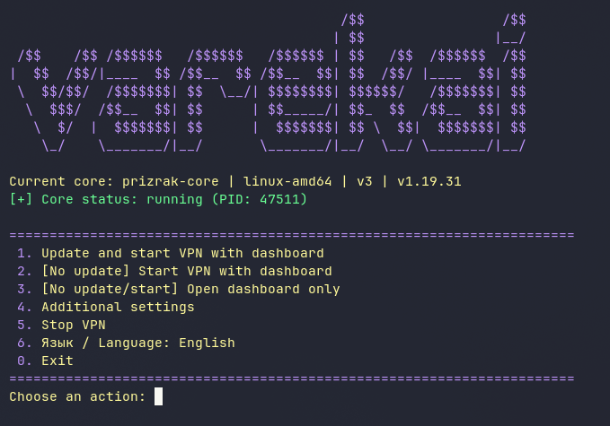
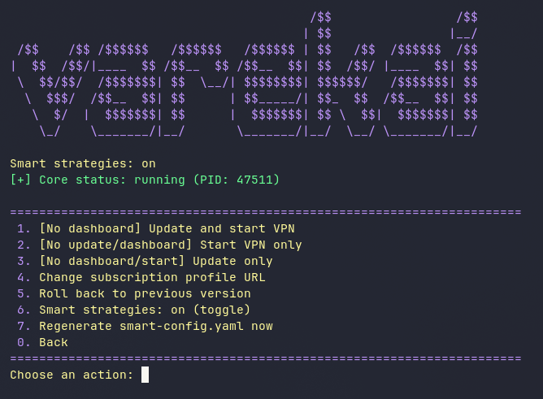

# Varekai Client

**English** | [Русский](README.ru.md)

|  |  |
|:---:|:---:|

A cross-platform launcher for the Prizrak-Core kernel [prizrak-core](https://github.com/legiz-ru/Prizrak-Core) with the [zashboard](https://github.com/Zephyruso/zashboard) web panel.
It downloads and updates the core, your subscription config and the panel,
starts the VPN and opens the dashboard. Maximum simplicity for everyone.

## Features

- Updates the core, the dashboard and your config on every run, with GitHub mirror fallback for blocked regions. You can add you own mirrors
- Injects "smart" proxy-group strategies into your config toggleable in the menu "Additional settings"
- Runs the VPN in TUN mode (requires admin/root)
- Opens the dashboard in its own window: bundled Chromium (Linux), system WebView2 (Windows), system WebKit (macOS)
- Keeps the last 3 core versions and can roll back
- The core runs independently: closing the launcher does not stop the VPN
- Russian and Englis languages (menu item 6)
- You can configure your Zashboard layout settings; they are saved in /zashboard-profile.

## Supported platforms

| OS | Architectures |
| --- | --- |
| Windows 10/11 | x86_64, ARM64 |
| Linux (any distro with a GUI) | x86_64, ARM64 |
| macOS 11+ | Apple Silicon |

## Requirements

- **Windows:** WebView2 runtime (ships with Edge); run as administrator
- **Linux:** polkit (`pkexec`) or sudo; standard desktop libraries (OpenGL, fontconfig, D-Bus, NSS)
- **macOS:** if Gatekeeper complains on first run — right click → Open, or `xattr -d com.apple.quarantine varekai-client`

## Installation (now - only from source)

```bash
git clone https://github.com/vrzdrb/varekai-client
cd varekai-client
python -m venv .venv
source .venv/bin/activate        # Windows: .venv\Scripts\activate
pip install -r requirements.txt
python main.py
```

## Usage

1. Start the program and pick menu item **1**: the core, your config and the panel are downloaded/updated, the VPN starts and the dashboard opens.
2. Closing the dashboard window exits the launcher but **does not stop the VPN**. To stop the VPN - oly use menu item **5**.
3. Depending on your needs, you can launch the VPN without the panel / without an update / open the panel without restarting the VPN / enable or disable smart strategies, etc. See "Advanced Settings."

## Files created at runtime

- `config.yaml` — your subscription config (downloaded from the link in `URL.txt`)
- `smart-config.yaml` — PC config generated from `config.yaml` with injected smart-groups
- `prizrak-core` / `prizrak-core.exe` — the kernel
- `archives/` — core archives for rollback
- `zashboard/` — the web panel
- `zashboard-profile/` — panel settings (language, theme, wallpaper…)
- `mirrors.txt` — GitHub mirrors used when github.com is unreachable
- `settings.json` — launcher settings (smart-strategy, menu language)
- `VPN.log`, `panel.log` — logs for troubleshooting
