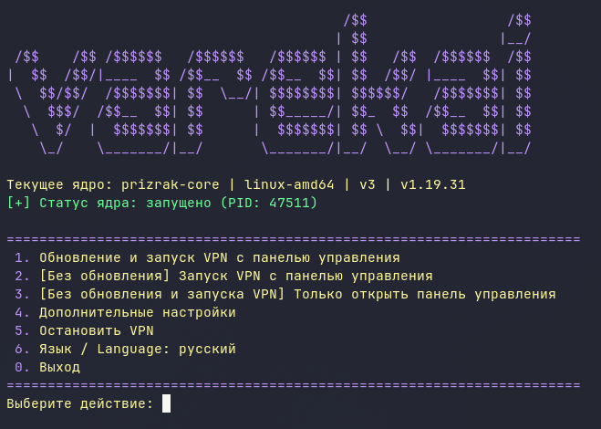
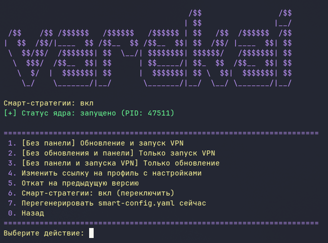

# Varekai Client

[English](README.md) | **Русский**

|  |  |
|:---:|:---:|

Кроссплатформенный лаунчер ядра Prizrak-Core [prizrak-core](https://github.com/legiz-ru/Prizrak-Core) с веб-панелью [zashboard](https://github.com/Zephyruso/zashboard).
Сам скачивает и обновляет ядро, ваш конфиг и панель, запускает VPN и открывает панель управления. Максимальная простота меню для пользователя любого уровня подготовки.

## Возможности

- При каждом запуске обновляет ядро, панель и ваш конфиг; при недоступности GitHub — через зеркала из `mirrors.txt`. Можно добавлять свои зеркала
- Умеет внедрять «смарт»-стратегии в прокси-группы вашего конфига (переключается в "Дополнительных настройках")
- Запускает VPN в TUN-режиме (нужны права администратора/root)
- Открывает панель в отдельном окне: встроенный Chromium (Linux), системный WebView2 (Windows), системный WebKit (macOS)
- Хранит три последние версии ядра и умеет откатываться назад
- Ядро работает независимо от скрипта-меню: закрыли меню или полностью терминал — VPN не упал
- Интерфейс меню на двух языках: русском и английском (пункт 6)
- Вы можете задавать свои настройки оформления Zashboard, они сохраняются в /zashboard-profile

## Поддерживаемые платформы

| Платформа | Архитектуры |
| --- | --- |
| Windows 10/11 | x86_64, ARM64 |
| Linux (любой дистрибутив с GUI) | x86_64, arm64 |
| macOS 11+ | Apple Silicon |

## Требования

- **Windows:** WebView2 Runtime (входит в Edge); запуск от администратора
- **Linux:** polkit (`pkexec`) или sudo; стандартные библиотеки окружения (OpenGL, fontconfig, D-Bus, NSS)
- **macOS:** если система блокирует запуск — ПКМ → «Открыть», либо `xattr -d com.apple.quarantine varekai-client`

## Установка (пока из исходников)

```bash
git clone https://github.com/vrzdrb/varekai-client
cd varekai-client
python -m venv .venv
source .venv/bin/activate        # Windows: .venv\Scripts\activate
pip install -r requirements.txt
python main.py
```

## Использование

1. Запустите программу и выберите пункт **1**: ядро, конфиг и панель скачаются/обновятся, VPN запустится, откроется панель управления.
2. Закрытие окна панели завершает лаунчер, но **НЕ останавливает VPN**. Остановка VPN — только через пункт меню **5**.
3. В зависимости от ваших потребностей, вы можете запускать VPN без панели / без обновления / открыть панель, не перезапуская VPN / отключать или подключать обратно smart-стратегии и т.д. См. "Дополнительные настройки"


## Файлы, которые появляются при работе

- `config.yaml` — ваш конфиг из подписки (скачивается по ссылке из `URL.txt`)
- `smart-config.yaml` — ПК-конфиг, сгенерированный из `config.yaml` с внедрёнными смарт-группами
- `prizrak-core` / `prizrak-core.exe` — ядро
- `archives/` — архивы ядра для отката
- `zashboard/` — веб-панель
- `zashboard-profile/` — настройки панели (язык, тема, фон и т.д.)
- `mirrors.txt` — зеркала GitHub на случай недоступности github.com
- `settings.json` — настройки лаунчера (смарт-стратегии, язык меню)
- `VPN.log`, `panel.log` — логи для диагностики
