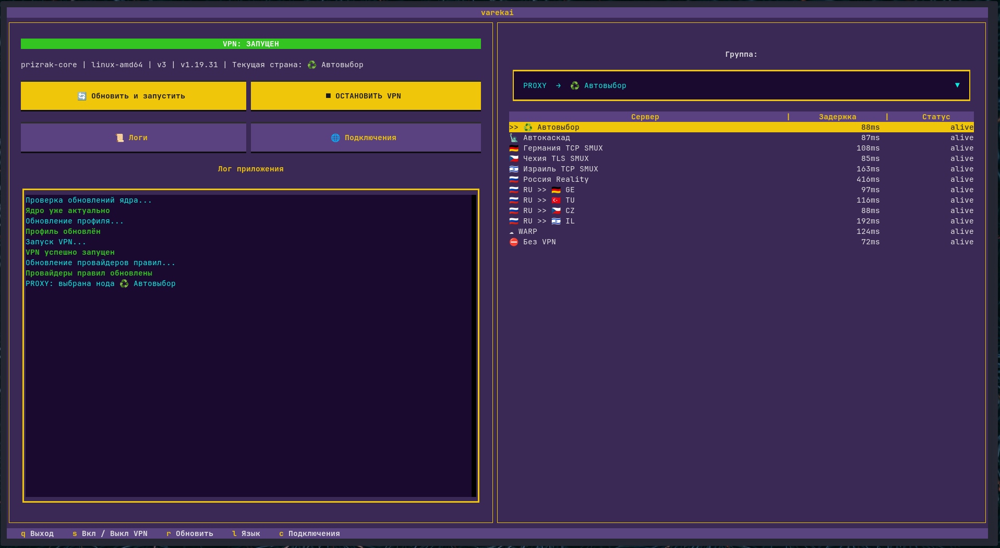

# Varekai Client

[English](README.md) | [Русский](README.ru.md)



Кроссплатформенный TUI для ядра [Prizrak-Core](https://github.com/legiz-ru/Prizrak-Core).
Максимальная простота для пользователя любого уровня подготовки.

## Возможности

- При каждом запуске обновляет ядро и ваш конфиг; при недоступности GitHub — через зеркала из `mirrors.txt`. Можно добавлять свои зеркала
- Внедряет «смарт»-стратегии в прокси-группы вашего конфига
- Запускает VPN только в TUN-режиме (нужны права администратора/root)
- Хранит три последние версии ядра и умеет откатываться назад
- Ядро работает независимо от лаунчера: закрыли лаунчер — VPN не упал
- Интерфейс на двух языках: русском и английском
- Поддерживает управление мышью

## Поддерживаемые платформы

| Платформа | Архитектуры |
| --- | --- |
| Windows 10/11 | x86_64 |
| Linux (любой дистрибутив) | x86_64 |
| macOS 11+ | Apple Silicon |

## Требования

- Любой терминал
- Любой сетевой интерфейс
- Интернет

## Установка

Скачайте исполняемый файл из releases, или запустите как python-скрипт:

```bash
git clone https://github.com/vrzdrb/varekai-client
cd varekai-client
python -m venv .venv
source .venv/bin/activate        # Windows: .venv\Scripts\activate
pip install textual httpx requests ruamel.yaml
python main.py
```

## Файлы, которые появляются при работе

  - config.yaml — ваш конфиг из подписки (скачивается по ссылке из URL.txt)
  - smart-config.yaml — ПК-конфиг, сгенерированный из config.yaml с внедрёнными смарт-группами
  - prizrak-core / prizrak-core.exe — ядро
  - archives/ — архивы ядра для отката
  - mirrors.txt — зеркала GitHub на случай недоступности github.com
  - settings.json — настройки лаунчера
  - VPN.log — логи для диагностики
